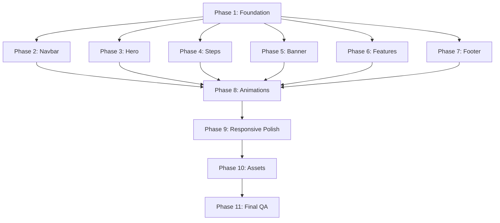

# Implementation Plan — Cadbury × Dopamint "Talk to Santa"

## Architecture Overview

**Stack:** Static HTML5 + Vanilla CSS3 + Vanilla JavaScript  
**Tooling:** None required (no bundler, no preprocessor)  
**Deployment:** Static file hosting  
**Approach:** Mobile-first responsive design

---

## File Structure

```
cadburyxdopamint/
├── index.html              # Single-page HTML
├── css/
│   ├── variables.css       # CSS custom properties (design tokens)
│   ├── reset.css           # CSS reset / normalize
│   ├── typography.css      # Font imports, type scale, text utilities
│   ├── layout.css          # Container, grid, flex utilities
│   ├── navbar.css          # Navigation bar styles
│   ├── hero.css            # Hero section styles
│   ├── steps.css           # "Three Steps" section styles
│   ├── banner.css          # Prize banner styles
│   ├── features.css        # "Why People Are Talking" section styles
│   ├── village.css         # Footer illustration scene styles
│   ├── footer.css          # Footer styles
│   ├── animations.css      # Keyframes, scroll animations, transitions
│   └── responsive.css      # All media query overrides
├── js/
│   ├── main.js             # Entry point, initializes all modules
│   ├── navbar.js           # Mobile menu toggle, sticky behavior
│   ├── scroll-animations.js # Intersection Observer for reveal animations
│   └── sparkles.js         # Gold sparkle particle effect (canvas or CSS)
├── assets/
│   ├── images/
│   │   ├── cadbury-logo-gold.svg
│   │   ├── santa-hero.png
│   │   ├── golden-arch.svg
│   │   ├── ribbon-wave.svg
│   │   ├── santa-hat.png
│   │   ├── gift-box.png
│   │   ├── speech-bubble.svg
│   │   ├── dairy-milk-pack.png
│   │   ├── christmas-bauble.png
│   │   ├── chocolate-bars.png
│   │   ├── chocolate-stack-1.png
│   │   ├── chocolate-stack-2.png
│   │   ├── snow-globe.png
│   │   ├── village-scene.png
│   │   ├── cadbury-truck.png
│   │   └── star-sparkle.svg
│   └── icons/
│       ├── instagram.svg
│       ├── twitter.svg
│       ├── youtube.svg
│       ├── tiktok.svg
│       ├── chevron-down.svg
│       ├── play-circle.svg
│       ├── check-circle.svg
│       └── hamburger.svg
├── prd.md
├── design.md
├── implementation-plan.md
└── todo.md
```

---

## Implementation Phases

### Phase 1: Foundation (CSS Architecture + HTML Skeleton)

**Objective:** Set up the design system in code and create the semantic HTML structure.

#### 1.1 CSS Foundation
1. Create `css/reset.css` — Minimal CSS reset (box-sizing, margin/padding reset, image defaults)
2. Create `css/variables.css` — All CSS custom properties from design.md:
   - Color tokens (purple palette, gold palette, cream neutrals, functional colors)
   - Typography tokens (font families, sizes, weights, line-heights)
   - Spacing tokens (8px grid scale)
   - Transition tokens
   - Shadow tokens
   - Border-radius tokens
   - Z-index scale
3. Create `css/typography.css`:
   - Google Fonts import (`Playfair Display` 700/800, `Inter` 400/500/600)
   - Base body styles
   - Heading styles (h1–h4)
   - Utility classes (`.text-label`, `.text-small`, `.text-gold`, `.text-italic-purple`)
4. Create `css/layout.css`:
   - `.container` (max-width, auto margins, responsive padding)
   - Flex/grid utility classes
   - Section padding utility

#### 1.2 HTML Structure
5. Create `index.html` with full semantic structure:
   - `<!DOCTYPE html>`, meta tags, OG tags, SEO tags
   - CSS imports
   - `<header>` — Navigation
   - `<main>`:
     - `<section id="hero">` — Hero section
     - `<section id="experience">` — Three steps
     - `<section id="prizes">` — Prize banner
     - `<section id="features">` — Why people are talking
     - `<div class="village-scene">` — Illustration
   - `<footer>` — Footer
   - JS imports (deferred)

**Deliverables:** HTML skeleton renders in browser with correct semantic structure, design tokens loaded, fonts loading.

---

### Phase 2: Navigation Bar

**Objective:** Fully styled, responsive sticky navigation.

6. Create `css/navbar.css`:
   - Fixed positioning, backdrop blur, border-bottom
   - Flex layout: logo area | nav links | sign-in button
   - Logo styling (gold SVG/text)
   - Star icon between logo and "Talk to Santa" text
   - Nav link styles (cream, hover underline)
   - Dropdown chevron icons (visual only, non-functional)
   - Sign-in pill button (gold bg, purple text)
   - Mobile: hamburger icon visible, nav links hidden
   - Mobile drawer: slide-in from right, full-height overlay

7. Create `js/navbar.js`:
   - Toggle mobile menu open/close
   - Close menu on link click
   - Close menu on outside click
   - Optional: Add/remove scroll class for navbar background opacity change

**Deliverables:** Sticky nav works on all breakpoints, mobile hamburger toggles drawer.

---

### Phase 3: Hero Section

**Objective:** The visual centrepiece — two-column hero with all decorative elements.

8. Create `css/hero.css`:
   - Full-viewport background with purple radial gradient
   - Two-column flex layout (text 45% / image 55%)
   - Tag line styling (gold, uppercase, letter-spaced)
   - Main heading (large serif, "purple" word in italic + purple color)
   - Body text styling (cream, spaced)
   - CTA buttons row (primary filled + secondary outlined)
   - Trust badge (green check + text)
   - Privacy note (small, muted)
   - **Golden arch frame:** CSS border with rounded top (or SVG background), gold gradient border, glow shadow
   - **Santa image:** Object-fit cover inside the arch container
   - **Purple ribbon:** Positioned at bottom via `clip-path` or SVG, overlapping hero-to-steps transition
   - **Decorative chocolate bars:** Absolute positioned PNGs in bottom-left area
   - Cadbury logo on ribbon (absolute positioned)

9. Responsive hero adjustments:
   - Tablet: Reduce heading size, tighten spacing
   - Mobile: Stack image below text, full-width CTAs, ribbon simplifies

**Deliverables:** Hero section matches reference design at all breakpoints.

---

### Phase 4: Three Steps Section

**Objective:** The "Experience" section with three step cards.

10. Create `css/steps.css`:
    - Section with cream background
    - Section header: label ("THE EXPERIENCE") + heading + subtitle
    - Label with decorative lines on either side (CSS pseudo-elements)
    - Sparkle icons flanking the heading (SVG or Unicode ✦)
    - Three-column card grid (CSS Grid or Flexbox)
    - Card styling: cream-light bg, rounded corners, padding, subtle border
    - Gold number badge: circle, gold border, centered number
    - Icon/image positioning (left of title or above)
    - Title + description text styling
    - Responsive: cards stack vertically on mobile

**Deliverables:** Three-step section matches reference with correct card styling.

---

### Phase 5: Prize Banner

**Objective:** Full-width purple promotional banner.

11. Create `css/banner.css`:
    - Container within max-width, full purple gradient background
    - Rounded corners (24px)
    - Three-area layout: product image | text content | ornament image
    - Heading in gold/cream serif
    - Body text in cream
    - Small terms text below
    - Product image (Dairy Milk pack) — angled, left side
    - Christmas bauble — right side, partially overlapping edge
    - **Sparkle effect overlay:** Gold dots/particles with CSS animation or pseudo-elements
    - Responsive: stacks vertically on mobile

**Deliverables:** Prize banner with sparkle effects and correct layout.

---

### Phase 6: Features Section

**Objective:** "Why People Are Talking" feature cards.

12. Create `css/features.css`:
    - Section header: label + heading + gold underline
    - Three-column card grid
    - Card: rounded corners, overflow hidden, image on top, text below
    - Image container with aspect ratio
    - Title + description styling
    - Subtle border/shadow
    - Responsive: cards stack vertically on mobile

**Deliverables:** Feature cards section matches reference design.

---

### Phase 7: Footer Scene + Footer

**Objective:** Illustrated village transition and footer content.

13. Create `css/village.css`:
    - Full-width image container
    - Village illustration as background-image or ``
    - Maintains aspect ratio, responsive width
    - May have subtle CSS parallax or fixed background

14. Create `css/footer.css`:
    - Deep purple background
    - Flex layout: logo | legal text | partner text + socials
    - Large Cadbury logo (gold)
    - Legal text in small cream text
    - Social icons row: gold/cream SVG icons with hover opacity
    - Responsive: stacks vertically and centers on mobile

**Deliverables:** Village scene displays correctly, footer matches reference.

---

### Phase 8: Animations & Interactions

**Objective:** Bring the page to life with scroll animations and micro-interactions.

15. Create `css/animations.css`:
    - `@keyframes fadeInUp` — for scroll reveal
    - `@keyframes shimmer` — for gold shimmer effects
    - `@keyframes sparkle` — for sparkle pulse
    - `@keyframes float` — for gentle floating elements
    - `.reveal` class (initial state: opacity 0, translateY 30px)
    - `.reveal.active` (animated state: opacity 1, translateY 0)
    - `prefers-reduced-motion` override: disable all animations

16. Create `js/scroll-animations.js`:
    - IntersectionObserver watching all `.reveal` elements
    - Threshold: 0.15 (triggers when 15% visible)
    - Adds `.active` class to trigger CSS animation
    - Stagger delay for card groups (using `data-delay` attribute)

17. Create `js/sparkles.js`:
    - Generate gold sparkle dots inside the prize banner
    - Either CSS-only (multiple pseudo-elements) or lightweight JS (canvas/DOM particles)
    - Particles: small circles, gold color, random position, pulse/fade animation

18. Button hover effects:
    - Primary CTA: lift + shadow on hover
    - Secondary CTA: fill with slight transparency on hover
    - Sign-in button: lighten gold on hover
    - Nav links: underline animation on hover

**Deliverables:** Page has smooth scroll reveals, sparkle effects, and interactive hover states.

---

### Phase 9: Responsive Polish

**Objective:** Ensure pixel-perfect responsiveness across all breakpoints.

19. Create `css/responsive.css` (or finalize responsive rules across files):
    - Mobile (≤767px): Test and fix all stacked layouts
    - Tablet (768px–1023px): Test and fix hybrid layouts
    - Desktop (1024px–1279px): Test and fix standard layouts
    - Large desktop (≥1280px): Test max-width containers
    - Test specific devices: iPhone SE, iPhone 14 Pro, iPad, iPad Pro, MacBook, 1440p monitor

20. Cross-browser testing:
    - Chrome, Firefox, Safari, Edge
    - Fix any vendor prefix issues
    - Test backdrop-filter fallbacks

**Deliverables:** Page looks and works correctly on all target devices and browsers.

---

### Phase 10: Asset Generation & Optimization

**Objective:** Create all image assets needed for the page.

21. Generate images using AI image generation tool:
    - Santa hero image
    - Cadbury logo (gold)
    - Chocolate product images
    - Christmas illustrations (snow globe, gift box, Santa hat)
    - Village scene illustration
    - Christmas bauble ornament

22. Optimize all assets:
    - Compress PNGs
    - Add appropriate alt text in HTML
    - Lazy-load below-fold images
    - Set explicit width/height to prevent CLS

**Deliverables:** All image assets generated, optimized, and integrated.

---

### Phase 11: Final QA & SEO

**Objective:** Final quality checks and SEO optimization.

23. SEO audit:
    - Verify single H1 tag
    - Check heading hierarchy
    - Add/verify meta description, title tag
    - Add Open Graph tags
    - Add favicon
    - Verify all alt texts

24. Performance audit:
    - Check LCP < 3s
    - Minimize CSS (remove unused styles)
    - Ensure above-fold content loads first
    - Verify lazy loading works

25. Accessibility audit:
    - Tab navigation works correctly
    - Screen reader announces content properly
    - Color contrast passes WCAG AA
    - Touch targets ≥ 44px on mobile

**Deliverables:** Production-ready landing page.

---

## Dependency Graph



> **Note:** Phases 2–7 can be worked on in parallel after Phase 1 is complete. Phase 8 depends on all section styles being in place. Phases 9–11 are sequential.

---

## Risk Mitigation

| Risk | Mitigation |
|------|-----------|
| Image assets unavailable | Use AI image generation; design CSS to gracefully handle missing images with placeholder backgrounds |
| Gold text on purple may fail contrast | Test all text combinations against WCAG; add subtle text-shadow for readability if needed |
| Heavy images slow load time | Lazy-load, compress, use modern formats; inline critical CSS |
| Complex ribbon/wave shape hard to CSS | Fall back to SVG image if `clip-path` proves unreliable cross-browser |
| Sparkle animation impacts performance | Use `will-change: opacity, transform`; limit particle count; respect `prefers-reduced-motion` |

---

## Estimated Timeline

| Phase | Effort |
|-------|--------|
| Phase 1: Foundation | ~30 min |
| Phase 2: Navbar | ~20 min |
| Phase 3: Hero | ~45 min |
| Phase 4: Steps | ~25 min |
| Phase 5: Banner | ~25 min |
| Phase 6: Features | ~20 min |
| Phase 7: Footer | ~20 min |
| Phase 8: Animations | ~30 min |
| Phase 9: Responsive | ~30 min |
| Phase 10: Assets | ~30 min |
| Phase 11: Final QA | ~15 min |
| **Total** | **~5 hours** |
